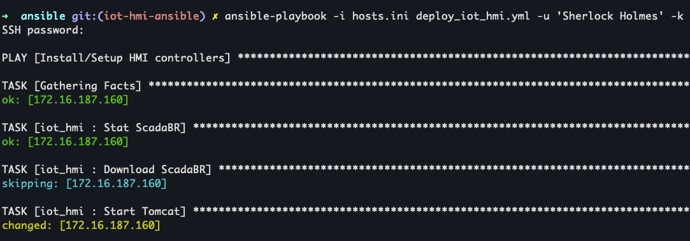

# Ansible - IoT HMI Controllers
## Description

This Ansible playbook will setup HMI controllers on a set of EC2 instances. The software used to emulate an HMI controller is [ScadaBR](https://github.com/ScadaBR)


## Init Ansible playbook
1. Open `hosts.ini` and set:
```
[iot_hmi]
172.16.187.160
...
```
1. `vim ansible/group_vars/windows.yml`

## Run Ansible playbook
1. `ansible-playbook -i hosts.ini deploy_iot_hmi.yml -u <user> -k`
    1. Enter Windows password
    1. 

## References
* [ansible.builtin.debug module](https://docs.ansible.com/ansible/latest/collections/ansible/builtin/debug_module.html)
* [Installation problem scadaBr](http://forum.scadabr.com.br/t/installation-problem-scadabr/873)
* [TightVNC for Windows: Installing from MSI Packages](https://www.tightvnc.com/doc/win/TightVNC-installer-2.5.2.pdf)
* [Download TightVNC for Windows (Version 2.8.75)](https://www.tightvnc.com/download.php)
* [Apache Tomcat 9 - Windows Service How-To](https://tomcat.apache.org/tomcat-9.0-doc/windows-service-howto.html)
* [Installing Apache Tomcat v7.x silently with command line options](https://shieldmaster.wordpress.com/2013/06/01/installing-apache-tomcat-v7-x-silently-with-command-line-options/)
* [Install Tomcat With Powershell](https://teppos.com/blog/install_tomcat_with_powershell/)
* [Install Tomcat as a Windows Service](https://www.ge.com/digital/documentation/meridium/APMConnect/V3.6_SAPPIV1.0.0_EAMSAPV1.5.1/Content/StartTomcatService.htm#:~:text=Right%2Dclick%20on%20Command%20Prompt,bat%20install%20TAC_Tomcat.)
* [Installing Apache Tomcat on Windows](http://openl-tablets.org/files/openl-tablets/5.14.0/OpenL%20Tablets%20-%20Installation%20Guide/SMPUserInstallingApacheTomcatOnWindows.html#_How_to_Installing)
* [Using Python on Windows](https://docs.python.org/3.6/using/windows.html#installing-without-ui)
* [ScadaBR](https://github.com/ScadaBR)
* []()
* []()
* []()
