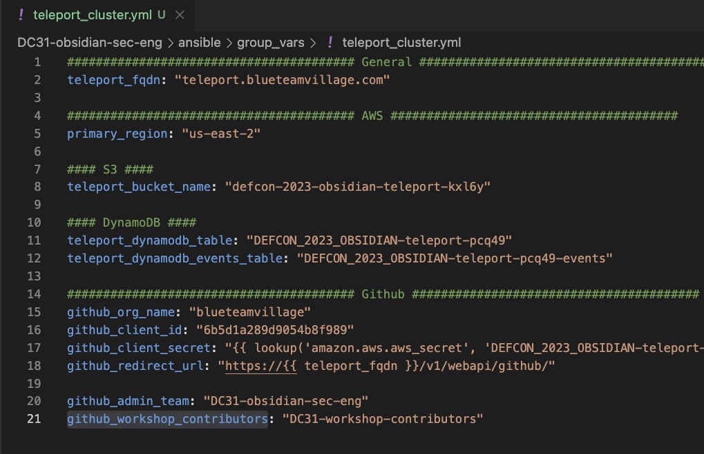

# Ansible - Teleport cluster

## Description
This Ansible playbook will setup a Teleport cluster on a set of EC2 instances. This playbook imports the Ansible role defined [btv-sec-eng-teleport-cluster](https://github.com/blueteamvillage/btv-sec-eng-teleport-cluster/) repo. Lastly, this role assumes you have used the Terraform module to provision all the AWS resources, please see [btv-sec-eng-teleport-cluster](https://github.com/blueteamvillage/btv-sec-eng-teleport-cluster/) for more details.

## Init Ansible playbook
1. Install AWS packages for Ansible: `ansible-galaxy collection install amazon.aws`
1. Install the Python package Boto to interact with AWS: `pip3 install -U boto3==1.26.69`
1. `group_vars/teleport_cluster.yml` and set:
    1. General
        1. `teleport_fqdn` - Set the fully qualified domain for Teleport
        1. `primary_region` - Set to the region where you want to host Teleport
    1. AWS
        1. `teleport_bucket_name` - Set this to the name of the S3 bucket created by the Terraform for Teleport
        1. `teleport_dynamodb_table` - Set this to the name of the DynamoDB table  created by the Terraform for Teleport
            1. Name schmea: `"${var.PROJECT_PREFIX}-teleport-${random_string.suffix.result}"`
            1. [AWS DynamoDB Table view](https://us-east-2.console.aws.amazon.com/dynamodbv2/home?region=us-east-2#tables)
        1. `teleport_dynamodb_events_table` - Set this to the name of the DynamoDB table  created by the Terraform for Teleport
            1. Name schmea: `"${var.PROJECT_PREFIX}-teleport-${random_string.suffix.result}-events"`
            1. [AWS DynamoDB Table view](https://us-east-2.console.aws.amazon.com/dynamodbv2/home?region=us-east-2#tables)
    1. Github
        1. `github_org_name` - Name of the Github org for SSO
        1. `github_client_id` - The Github Oauth client ID  - NOT a secret
        1. `github_client_secret` - Define the name of the AWS Secret that contains the Github Oauth client` secret.
        1. `github_redirect_url` - Leave this as the default value unless you are hosting Teleport at a different URL path.
        1. `github_admin_team` - Define the Github team that contains a list of users that will be admins for the Teleport cluster
        1. `github_workshop_contributors` - Define the Github team that contains a list of users that will be accessing computing resources behind the Teleport cluster
    1. 
    1. Save and exit

## Run Ansible playbook
1. `ansible-playbook -i hosts.ini deploy_teleport_cluster.yml`

## Supported versions
* `btv-sec-eng-teleport-cluster v1.0.0`

## References
* [btv-sec-eng-teleport-cluster](https://github.com/blueteamvillage/btv-sec-eng-teleport-cluster/)
