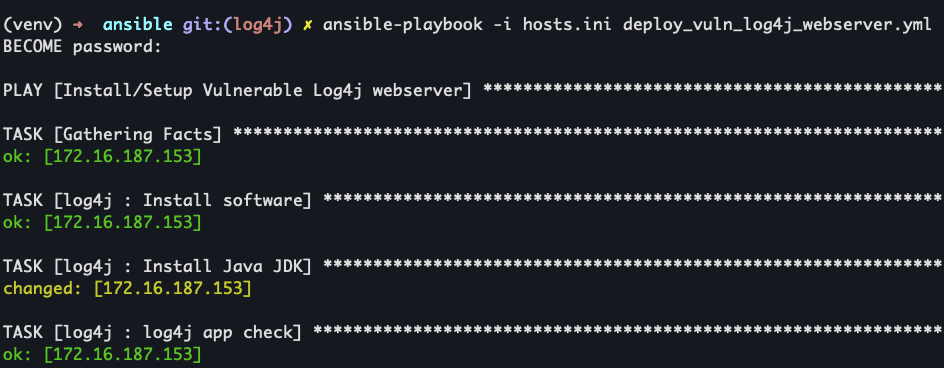

# Ansible - Vulnerable Log4j web server
## Description
This Ansible playbook will deploy [Github - ChoiSG/log4shell-dockerlab](https://github.com/ChoiSG/log4shell-dockerlab) vulnerable log4j web server.

## Init Ansible playbook
1. `cd ansible/`
1. `vim ansible/hosts.ini` and set `[log4j]` to the IP address of the server

## Run Ansible playbook
1. `ansible-playbook -i hosts.ini deploy_vuln_log4j_webserver.yml`
    1. 

## References
* [Github - ChoiSG/log4shell-dockerlab](https://github.com/ChoiSG/log4shell-dockerlab)
* [Github - marvel-nccr/ansible-role-ubuntu-desktop](https://github.com/marvel-nccr/ansible-role-ubuntu-desktop/blob/master/tasks/main.yml)
* [How to Download and Use Ansible Galaxy Roles in Ansible Playbook](https://www.linuxtechi.com/use-ansible-galaxy-roles-ansible-playbook/)
* [ansible.builtin.stat module](https://docs.ansible.com/ansible/latest/collections/ansible/builtin/stat_module.html)
* [ansible.builtin.file module](https://docs.ansible.com/ansible/latest/collections/ansible/builtin/file_module.html)
* [ansible.builtin.apt module](https://docs.ansible.com/ansible/latest/collections/ansible/builtin/apt_module.html)
* [8 steps to developing an Ansible role in Linux](https://www.redhat.com/sysadmin/developing-ansible-role)
* 
* 
* 
* 
