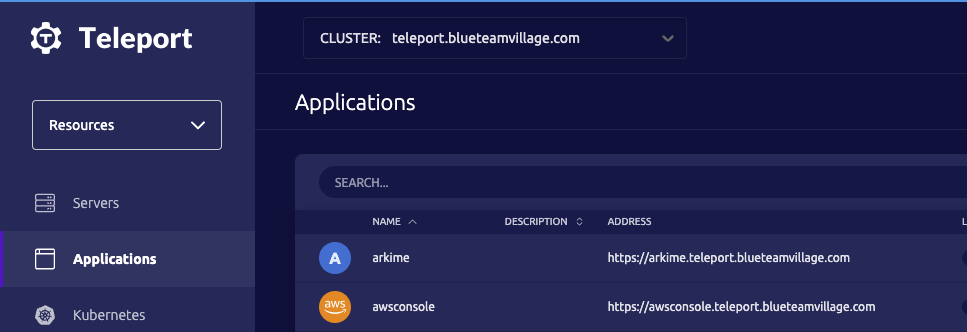
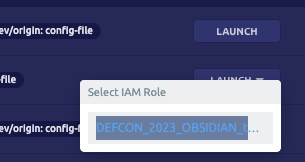
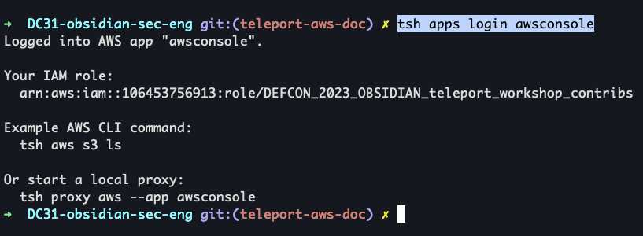
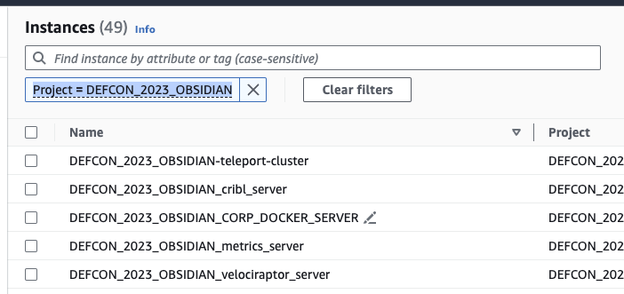
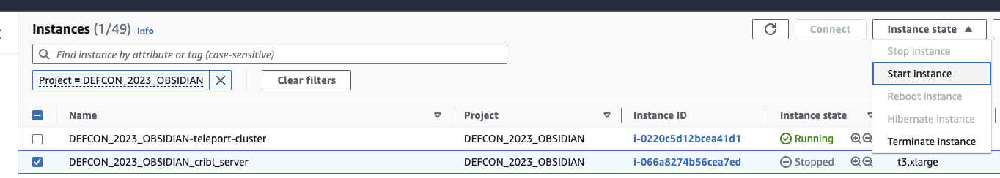
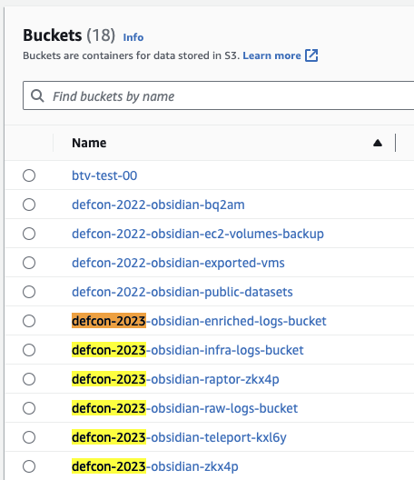

# Accessing AWS console OR CLI via Teleport

## Accessing AWS console via Teleport
1. Open your web browser to `https://teleport.blueteamvillage.com/web/login`
1. Log in with your Github account
    1. If you get access denied please reach out to your lead
1. Select "Applications" on the left
    1. 
1. Look for the application named `awsconsole`
1. Select "Launch" button and a drop down menu should appear
    1. Select `DEFCON_2023_OBSIDIAN_teleport_workshop_contribs`
    1. 

## Accessing AWS CLI via Teleport
1. Log into Teleport via tsh
    1. [teleport install/setup](teleport_jumpbox.md)
1. `tsh apps login awsconsole`
    1. 

## Turn EC2 instances on/off
1. Follow the instructions in "Accessing AWS console via Teleport" above
1. AWS console > EC2
1. The default state is `Instance state = running` which will only show running instances.
1. We recommend deleting this selection and selecting `Project = DEFCON_2023_OBSIDIAN`
    1. 
1. Select an instance 
1. In the top right select "Instance state" > "Start instance"
    1. 

## Upload/Download items to project S3 buckets
1. Follow the instructions in "Accessing AWS console via Teleport" above
1. AWS console > S3
    1. It should be noted that ALL buckets owned bt BTV will be listed. However, that does not mean you can upload/download to all the buckets. Teleport only has the ability to read/write to buckets starting with `defcon-2023*`
    1. 

## References
* [Access AWS With Teleport Application Access](https://goteleport.com/docs/application-access/cloud-apis/aws-console/)
* 
* 
* 
* 