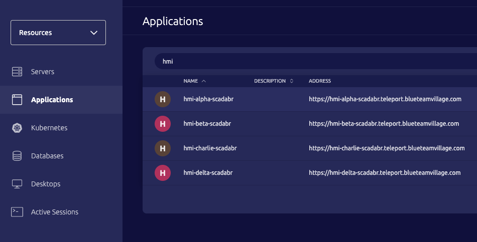
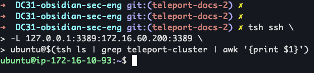
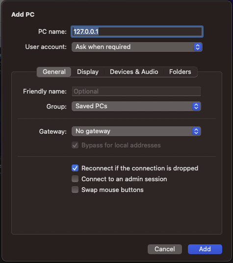
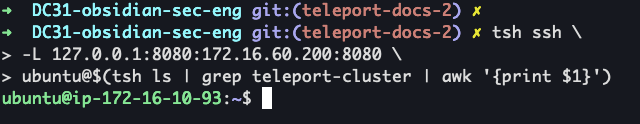
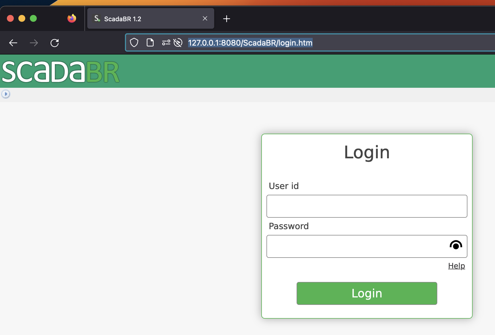
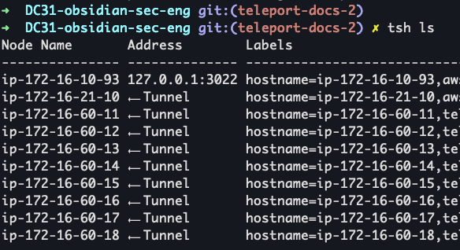
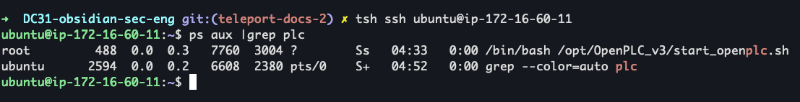

# Teleport for accessing IoT devices
## Description
This runbook is for the IoT admins to access the IoT devices.

## Pre-reqs
* [Teleport setup](docs/teleport_setup_login_runbook.md)
* Must be added to the following Github team [DC31-iot-team](https://github.com/orgs/blueteamvillage/teams/dc31-iot-team/members)
* Install [Microsoft Remote Desktop app](https://www.microsoft.com/store/apps/9wzdncrfj3ps)
* Access to the SecEng cred sheet - reach out to seceng to be granted access

## Connecting to Windows HMIs

### ScadaBR web portal via Teleport
THIS FEATURE IS EXPERIMENTAL, if you have any issues please use the method below `ScadaBR web portal via SSH tunnel`. If you run into any issues please report them to seceng.

1. Open a web browser to `https://teleport.blueteamvillage.com/`
1. Log into Teleport with your Github account
1. Select "Applications"
    1. 
1. Select "Launch" on the right for a scadaBR instance
1. Your browser should direct you to the scadaBR instance

### Connect to HMIs via RDP
This section assumes you have completed the pre-reqs.

1. Open terminal
1. `tsh ssh -L 127.0.0.1:3389:<Win HMI IP addr>:3389 ubuntu@ip-172-16-10-93`
    1. 
    1. `hmialpha` - `172.16.60.200`
    1. `hmibeta` - `172.16.60.201`
    1. `hmicharlie` - `172.16.60.202`
    1. `hmidelta` - `172.16.60.203`
1. Open an [Microsoft Remote Desktop app](https://www.microsoft.com/store/apps/9wzdncrfj3ps)
1. Select "Add PC"
    1. Enter `127.0.0.1` into PC Name
    1. Select "Add"
    1. 
1. Double click the new entry
1. Enter the username and password from the SecEng cred sheet - see prereq

### ScadaBR web portal via SSH tunnel
This section assumes you have completed the pre-reqs.

1. Open terminal
1. `tsh ssh -L 127.0.0.1:8080:<Win HMI IP addr>:8080 ubuntu@ip-172-16-10-93`
    1. `hmialpha` - `172.16.60.200`
    1. `hmibeta` - `172.16.60.201`
    1. `hmicharlie` - `172.16.60.202`
    1. `hmidelta` - `172.16.60.203`
    1. 
1. Open a web browser
1. Enter `http://127.0.0.1:8080/ScadaBR/login.htm`
    1. 

## Connecting to Ubuntu PLCs via Teleport/SSH
1. `tsh ls`
    1. 
1. `tsh ssh ubuntu@<PLC node name>`
    1. 

## References
* 
