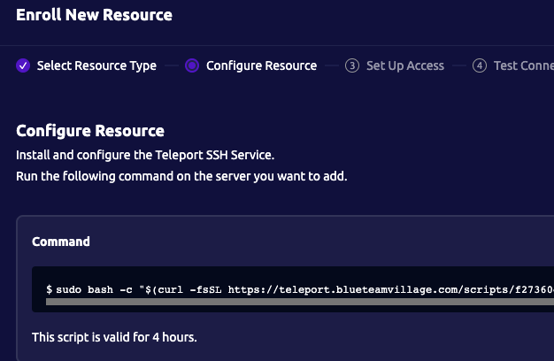
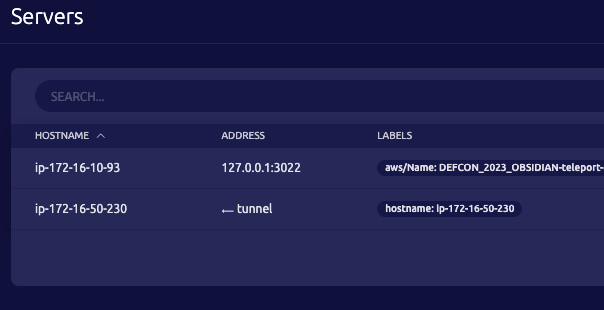
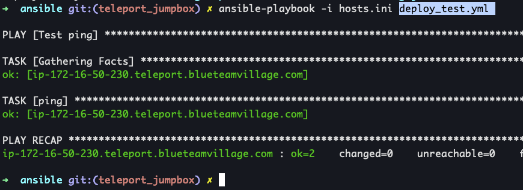

# Teleport Jumpbox

At the time of writing this doc, the sec-infra team doesn't have a way to automatically enroll EC2 instances when created by Terraform. For the time being, this doc will show you how to bootstap a new EC2 instance into Teleport.

## Network diagram
```
+-----------+           +-------------------+             +------------------+
|           |           |  Teleport proxy   |             |  EC2 instance    |
|   Client  +---------->|      /            +------------>+  behind Teleport |
|           |           |  jumpbox          |             |                  |
+-----------+           +-------------------+             +------------------+
```


## Install the Teleport TSH client
* [Windows](https://goteleport.com/docs/installation/#windows-tsh-client-only)
* [Linux](https://goteleport.com/docs/installation/#linux)
* [macOS](https://goteleport.com/docs/installation/#macos)

## User login via Github SSO
### Log into Teleport via browser
1. Browese to Teleport FQDN
    1. Ex: `https://teleport.blueteamvillage.com/web/login`
1. Select "Github"
1. Select "Authorize <Github org name>
    1. 

### Log into Teleport using tsh CLI
1. `tsh login --proxy=<teleport FQDN>`
    

### SSH into Teleport EC2 instance
```shell
➜ tsh ls
Node Name       Address        Labels
--------------- -------------- ------------------------
ip-172-16-10-93 127.0.0.1:3022 hostname=ip-172-16-10-93

➜ tsh ssh ubuntu@ip-172-16-10-93
ubuntu@ip-172-16-10-93:~$ whoami
ubuntu
ubuntu@ip-172-16-10-93:~$
```

## Use Teleport as jumpbox
1. `tsh ls`
    ```shell
    ➜  ~ tsh ls --query='labels["aws/Name"] == "DEFCON_2023_OBSIDIAN-teleport-cluster"'
    Node Name       Address        Labels
    --------------- -------------- --------------------------------------------------------------------------------------------------------
    ip-172-16-10-93 127.0.0.1:3022 hostname=ip-172-16-10-93,aws/Name=DEFCON_2023_OBSIDIAN-teleport-cluster,aws/Project=DEFCON_2023_OBSIDIAN
    ```
1. Copy the "Node Name" value for the Teleport node
1. `tsh ssh -L 2022:<EC2 instance IP addr BEHIND Teleport>:22 ubuntu@<teleport node name>`
    ```shell
    ➜  ~ tsh ssh -L 2022:172.16.50.230:22 ubuntu@ip-172-16-10-93
    ubuntu@ip-172-16-10-93:~$
    ```
1. Open a new terminal
1. `ssh-add .../DC31-obsidian-sec-eng/terraform/ssh_keys/id_ed25519`
    1. Enter password for SSH key
1. Copy your personal SSH key to the machine `ssh-copy-id -p 2022 ubuntu@127.0.0.1`
    ```shell
    ➜  ~ ssh-copy-id -p 2022 ubuntu@127.0.0.1
    /usr/bin/ssh-copy-id: INFO: attempting to log in with the new key(s), to filter out any that are already installed
    /usr/bin/ssh-copy-id: INFO: 4 key(s) remain to be installed -- if you are prompted now it is to install the new keys

    Number of key(s) added:        4

    Now try logging into the machine, with:   "ssh -p '2022' 'ubuntu@127.0.0.1'"
    and check to make sure that only the key(s) you wanted were added.
    ```
1. SSH to the host behind Teleport `ssh ubuntu@127.0.0.1 -p 2022`
    ```shell
    ➜  ~ ssh ubuntu@127.0.0.1 -p 2022
    Welcome to Ubuntu 22.04.1 LTS (GNU/Linux 5.15.0-1028-aws x86_64)

    * Documentation:  https://help.ubuntu.com
    * Management:     https://landscape.canonical.com
    * Support:        https://ubuntu.com/advantage

    System information as of Mon Feb 20 01:35:42 UTC 2023

    System load:  0.0               Processes:             101
    Usage of /:   20.1% of 7.57GB   Users logged in:       0
    Memory usage: 22%               IPv4 address for ens5: 172.16.50.230
    Swap usage:   0%
    ```

## Enroll host into Teleport
1. Browese to Teleport FQDN
    1. Ex: `https://teleport.blueteamvillage.com/web/login`
1. Select "Servers" on the right
1. Select "Add server" in the top-right
    1. Resource type
        1. Make sure "Server" is selected
        1. Select "Next"
    1. Configure resources
        1. Copy command
            1. 
        1. Select "Exit"
1. Go back to your terminal for the new instance
1. Paste the command from above
    ```shell
    ubuntu@ip-172-16-50-230:~$ sudo bash -c "$(curl -fsSL https://teleport.blueteamvillage.com/scripts/f27360d397abc1358c7ad8c6a792b5bb/install-node.sh)"
    2023-02-20 02:02:46 UTC [teleport-installer] TELEPORT_VERSION: 12.0.2
    2023-02-20 02:02:46 UTC [teleport-installer] TARGET_HOSTNAME: teleport.blueteamvillage.com
    2023-02-20 02:02:46 UTC [teleport-installer] TARGET_PORT: 443
    2023-02-20 02:02:46 UTC [teleport-installer] JOIN_TOKEN: f27360d397abc1358c7ad8c6a792b5bb
    2023-02-20 02:02:46 UTC [teleport-installer] CA_PIN_HASHES: sha256:5348f23e3b179ecca76e317e0f5740893c88b2ed6abe76fb3dac5a1323cd312b
    2023-02-20 02:02:46 UTC [teleport-installer] Checking TCP connectivity to Teleport server (teleport.blueteamvillage.com:443)
    2023-02-20 02:02:46 UTC [teleport-installer] Connectivity to Teleport server (via nc) looks good
    2023-02-20 02:02:46 UTC [teleport-installer] Detected host: linux-gnu, using Teleport binary type linux
    2023-02-20 02:02:46 UTC [teleport-installer] Detected arch: x86_64, using Teleport arch amd64
    2023-02-20 02:02:46 UTC [teleport-installer] Detected distro type: debian
    2023-02-20 02:02:46 UTC [teleport-installer] Using Teleport distribution: deb
    2023-02-20 02:02:46 UTC [teleport-installer] Created temp dir /tmp/teleport-gJziTDeBff
    2023-02-20 02:02:47 UTC [teleport-installer] Downloading Teleport deb release 12.0.2
    2023-02-20 02:02:47 UTC [teleport-installer] Running curl -fsSL --retry 5 --retry-delay 5 https://get.gravitational.com/teleport_12.0.2_amd64.deb
    2023-02-20 02:02:47 UTC [teleport-installer] Downloading to /tmp/teleport-gJziTDeBff/teleport_12.0.2_amd64.deb
    ...
    ...
    ...
    Teleport has been started.

    View its status with 'sudo systemctl status teleport.service'
    View Teleport logs using 'sudo journalctl -u teleport.service'
    To stop Teleport, run 'sudo systemctl stop teleport.service'
    To start Teleport again if you stop it, run 'sudo systemctl start teleport.service'

    You can see this node connected in the Teleport web UI or 'tsh ls' with the name 'ip-172-16-50-230'
    Find more details on how to use Teleport here: https://goteleport.com/docs/user-manual/

    ubuntu@ip-172-16-50-230:~$
    ```
1. Go back to Teleport in the browser
1. Select "Servers" on the right
    1. 
1. Terminate the TSH jumpbox tunnel

## Ansible + Teleport
1. Open `hosts.ini` and set:
```
[test]
ip-172-16-50-230.teleport.blueteamvillage.com ansible_user=ubuntu
```
1. `ansible-playbook -i hosts.ini deploy_<playbook>.yml`
    1. 


## References
* [Use ssh-copy-id with an OpenSSH Server Listening On a Different Port](https://www.cyberciti.biz/faq/use-ssh-copy-id-with-an-openssh-server-listing-on-a-different-port/)
* [Sync EC2 Tags and Teleport Node Labels](https://goteleport.com/docs/management/guides/ec2-tags/)
* [Teleport Labels](https://goteleport.com/docs/management/admin/labels/)
* [How to Use SSH Port Forwarding](https://phoenixnap.com/kb/ssh-port-forwarding)
* [Connecting to Teleport nodes with OpenSSH #5530](https://github.com/gravitational/teleport/discussions/5530)
* [JumpHost using a server #9011](https://github.com/gravitational/teleport/discussions/9011)
* [Using the tsh Command Line Tool](https://goteleport.com/docs/connect-your-client/tsh/#connecting-to-ssh-clusters-behind-firewalls)
* []()
* []()
* []()
* []()
