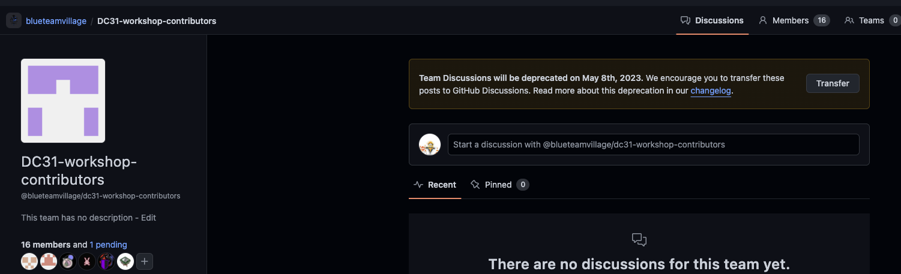
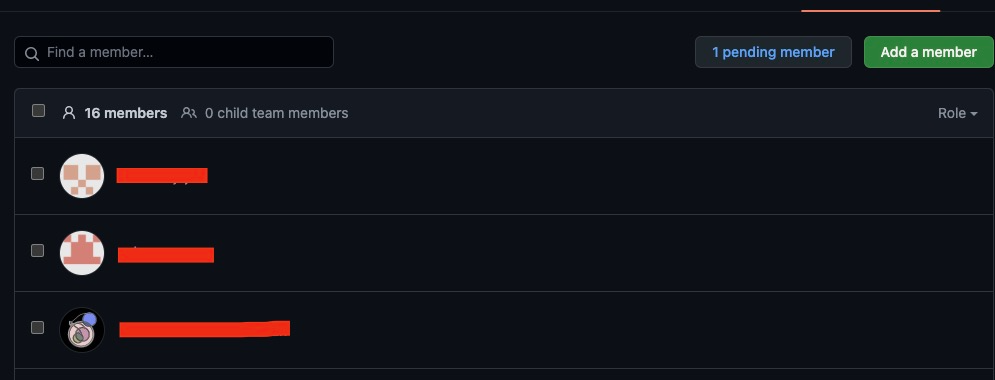
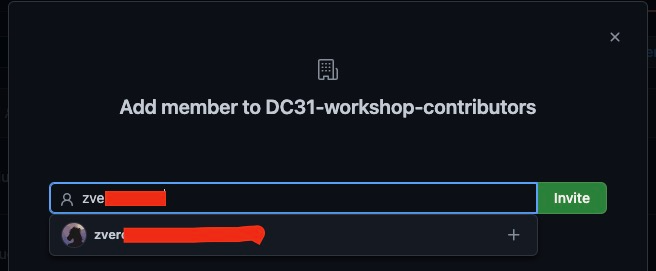

# Teleport leads runbook
The goal of this runbook is to provide a series of steps for leads to on-board team members to Teleport.

## Prereqs for leads
* You NEED to have a Github account
* Your Github account needs to be apart of the [BTV Github org](https://github.com/blueteamvillage)
* You NEED to have access to the [Github team](https://github.com/orgs/blueteamvillage/teams/dc31-obsidian-sec-eng/teams) for which you are adding a member too

## Prerqs for member being on-boarded
* They NEED to have a Github account

## Background
### What is Teleport?
Teleport is service the SecEng team is using to provide access to the workshop infrastructure. Teleport provides SSH and RDP access to EC2 instances in AWS using Github SSO for authentication. In addition, Teleport may provide access to web UIs.

## Steps to add new member
1. Log into Github
1. Browse to [BTV's Github teams list](https://github.com/orgs/blueteamvillage/teams/dc31-obsidian-sec-eng/teams)
1. Select the team you wish to add a member to
    1. 
1. Select "Members" at the top
    1. 
1. Select "Add a member"
    1. 
1. Provide the new team member [this runbook](teleport_setup_login_runbook.md) to setup their new access

## Troubleshooting
If you have any issues please reachout to the SecEng team in Discord via `#station-engineering`.

## References
* 
