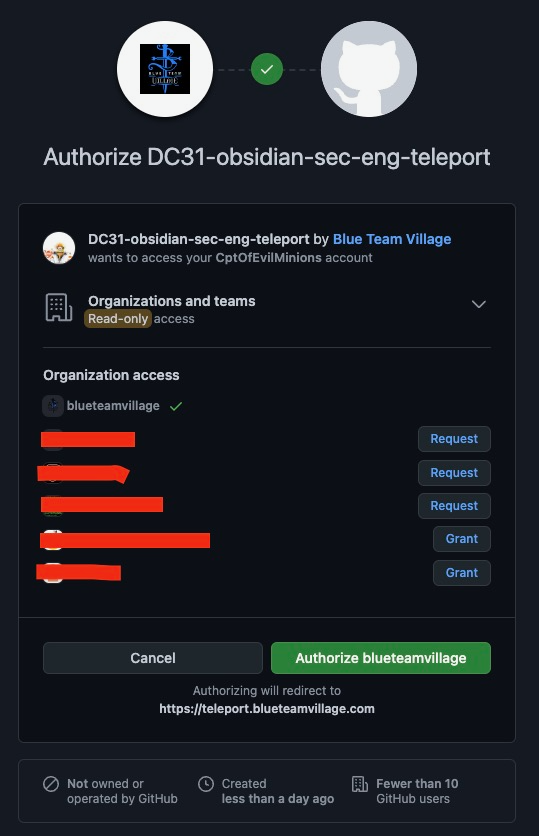
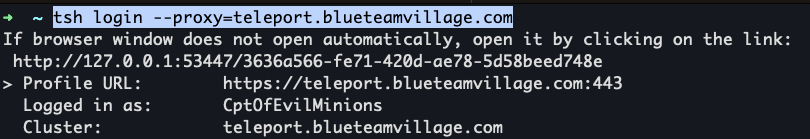

# Teleport setup and login runbook
The goal of this runbook is to help new users install Teleport on their local machine, setup Teleport with the BTV cluster, log into the Teleport, and a simple tutorial.

## Prereqs
* You NEED to have a Github account
* Your Github account needs to be apart of the [BTV Github org](https://github.com/blueteamvillage)
* Your Github account needs to be apart of the approraite [Github team](https://github.com/orgs/blueteamvillage/teams/dc31-obsidian-sec-eng/teams). If you don't have access please reach out to your lead.


# Guides to install Teleport
* [Teleport for Windows](https://goteleport.com/docs/installation/#windows-tsh-client-only)
    * [](https://www.youtube.com/watch?v=XH047Qc45xs)
* [Teleport for Linux](https://goteleport.com/docs/installation/#linux)
    * [](https://www.youtube.com/watch?v=x2KxhM_v4MM)
* [Teleport for macOS](https://goteleport.com/docs/installation/#macos)
    * [](https://www.youtube.com/watch?v=IdnQP-qCG7k)


## Log into Teleport via browser
1. Browese to Teleport FQDN
    1. Ex: `https://teleport.blueteamvillage.com/web/login`
1. Select "Github"
1. Select "Authorize <Github org name>
    1. 

## Log into Teleport using tsh CLI
1. `tsh login --proxy=<teleport FQDN>`
    

## List the servers you can SSH into
```shell
➜  DC31-obsidian-sec-eng git:(teleport-docs) ✗ tsh ls
Node Name       Address        Labels
--------------- -------------- ---------------------------------------------------------------------------------------------------------------------------------------------------------------
ip-172-16-10-93 127.0.0.1:3022 hostname=ip-172-16-10-93,aws/Name=DEFCON_2023_OBSIDIAN-teleport-cluster,aws/Project=DEFCON_2023_OBSIDIAN
ip-172-16-21-10 ⟵ Tunnel       hostname=ip-172-16-21-10,aws/Name=DEFCON_2023_OBSIDIAN_metrics_server,aws/Project=DEFCON_2023_OBSIDIAN,aws/Team=sec_infra,teleport.internal/resource-id=3631...
```

## SSH into your first host
1. `tsh ssh <username>@<Teleport node name>`
1. Example:
```shell
➜  DC31-obsidian-sec-eng git:(teleport-docs) ✗ tsh ssh ubuntu@ip-172-16-21-10
ubuntu@ip-172-16-21-10:~$
```

## Advanced: Setup your SSH config to use Teleport
This section is for advanced users who need to use SSH explicitly to access hosts behind Teleport. The SSH config generated bt Teleport proxies all SSH connections through Teleport. The way this works is the FQDN of the host must be specified and that schema is `ssh <username>@<Teleport node name>.teleport.blueteamvillage.com`.

1. `tsh config`
```shell
➜  DC31-obsidian-sec-eng git:(teleport-docs-3) tsh config
# Begin generated Teleport configuration for teleport.blueteamvillage.com by tsh

# Common flags for all teleport.blueteamvillage.com hosts
Host *.teleport.blueteamvillage.com teleport.blueteamvillage.com
    UserKnownHostsFile "/Users/thunderwagon/.tsh/known_hosts"
    IdentityFile "/Users/thunderwagon/.tsh/keys/teleport.blueteamvillage.com/CptOfEvilMinions"
    CertificateFile "/Users/thunderwagon/.tsh/keys/teleport.blueteamvillage.com/CptOfEvilMinions-ssh/teleport.blueteamvillage.com-cert.pub"
    HostKeyAlgorithms rsa-sha2-512-cert-v01@openssh.com,rsa-sha2-256-cert-v01@openssh.com,ssh-rsa-cert-v01@openssh.com

# Flags for all teleport.blueteamvillage.com hosts except the proxy
Host *.teleport.blueteamvillage.com !teleport.blueteamvillage.com
    Port 3022
    ProxyCommand "/usr/local/bin/tsh" proxy ssh --cluster=teleport.blueteamvillage.com --proxy=teleport.blueteamvillage.com %r@%h:%p

# End generated Teleport configuration
```
1. Append the above SSH config to your existing SSH config: `tsh config >> ~/.ssh/config`
1. `tsh ls`
```shell
➜  DC31-obsidian-sec-eng git:(teleport-docs-3) ✗ tsh ls
Node Name        Address        Labels
---------------- -------------- --------------------------------------------------------------------------------------------------------------------------------------------------------------
ip-172-16-10-93  127.0.0.1:3022 hostname=ip-172-16-10-93,aws/Name=DEFCON_2023_OBSIDIAN-teleport-cluster,aws/Project=DEFCON_2023_OBSIDIAN
```
1. `ssh <username>@<Teleport node name>.teleport.blueteamvillage.com`
1.
```shell
➜  DC31-obsidian-sec-eng git:(teleport-docs-3) ✗ ssh ubuntu@ip-172-16-10-93.teleport.blueteamvillage.com
ubuntu@ip-172-16-10-93:~$
```

## Advanced: Creating a normal SSH tunnel
This section assumes you did the instructions in the previous seciton. The command below will use SSH to create an SSH tunnel that can be used to funnel traffic.

1. `ssh -L 127.0.0.1:8080:<Win HMI IP addr>:8080 ubuntu@ip-172-16-10-93.teleport.blueteamvillage.com`

## Advanced: Specify s short name for a host
Example:
```shell
Host btv_so_serial
  Hostname serial-console.ec2-instance-connect.us-east-2.aws
  User i-0b92af4ea521fc37e.port0
  IdentityFile /path/DC31-obsidian-sec-eng/terraform/ssh_keys/id_ed25519
  ProxyJump ubuntu@ip-172-16-10-93.teleport.blueteamvillage.com
  # unix_listener: path "/home/<user>/.ssh/ctl-i-<ami>.port0-serial-console.ec2-instance-connect.us-east-2.aws-22.yL5bFjIUkgVu45DE" too long for Unix domain socket
  ControlPath ~/.ssh/ctl-%C

Host btv_docker
  Hostname 172.16.50.101
  User ubuntu
  IdentityFile /path/DC31-obsidian-sec-eng/terraform/ssh_keys/id_ed25519
  ProxyJump ubuntu@ip-172-16-10-93.teleport.blueteamvillage.com

Host btv_velo
  Hostname 172.16.22.130
  User ubuntu
  IdentityFile /path/DC31-obsidian-sec-eng/terraform/ssh_keys/id_ed25519
  ProxyJump ubuntu@ip-172-16-10-93.teleport.blueteamvillage.com
  LocalForward 8001 127.0.0.1:80
```


## Troubleshooting
If you have any issues please reachout to the SecEng team in Discord via `#station-engineering`.

## References
* []()
