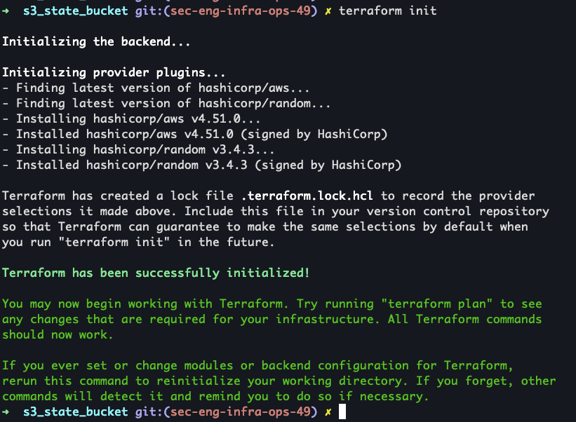

# Terraform

## AWS inital setup
### Create an AWS account
Follow the steps on this [page to create an AWS account](https://aws.amazon.com/premiumsupport/knowledge-center/

### Select a region and avability zone
Once you login into AWS it should automatically select the nearest datacenter based on your IP address. This repo has been created and tested on the US East - Ohio datacenter and avablility zone B. This repo should be compatible with any region and avability zone but pick the best region based on your location/users. As a side note, dedicated hosts to run macOS only exist in certain regions and avability zones which is why we selected Ohio for the region and B for the avability zone.

## Install/Setup AWS CLI and Terraform on macOS
* [AWS CLI Windows install](https://docs.aws.amazon.com/cli/latest/userguide/install-cliv2-windows.html)
* [AWS CLI Linux install](https://docs.aws.amazon.com/cli/latest/userguide/install-cliv2-linux.html)
* [AWS CLI macOS install](https://docs.aws.amazon.com/cli/latest/userguide/install-cliv2-mac.html)

### Generate AWS access keys
1. Select `<YOUR username>` in the top-right then "My Security Credentials"
1. Scroll down to "Access keys for CLI..."
1. Select "Create access key"
  1. Save your generated access key ID and secret access key in a safe location

### Install/Setup AWS CLI with AWS access keys
This is not required if you setup environment variables (AWS_ACCESS_KEY_ID, AWS_SECRET_ACCESS_KEY)

1. Open terminal
1. `curl "https://awscli.amazonaws.com/AWSCLIV2.pkg" -o /tmp/AWSCLIV2.pkg`
  1. Download AWS CLI v2
1. `sudo installer -pkg /tmp/AWSCLIV2.pkg -target /`
  1. Install AWS CLI v2
1. `aws configure`
  1. Paste the access key ID generated from above
  1. Paste the access key generated from above
  1. Enter your region - Ohio is `us-east-2`
  1. Leave ouput format as default
  1. 
1. Credentails are saved at `~/.aws/credentials`

## Install/Setup Terraform
### Install Terraform on macOS
It should be noted that this repo only supports Terraform v0.15 and greater.

* [Terraform install on Windows](https://learn.hashicorp.com/tutorials/terraform/install-cli)
* [Terraform install on Linux ](https://learn.hashicorp.com/tutorials/terraform/install-cli)
* [Terraform install on macOS](https://learn.hashicorp.com/tutorials/terraform/install-cli)

1. `brew tap hashicorp/tap`
1. `brew install hashicorp/tap/terraform`

# Spin up Terraform environment
## Setup S3 state bucket
1. `git clone git@github.com:blueteamvillage/DC31-obsidian-sec-eng.git`
1. `cd DC31-obsidian-sec-eng/terraform/s3_state_bucket`
1. `terraform init`
    1. 
1. `terraform apply`
    1. 
    1. Enter `yes` to apply these changes
    1. Copy the bucket name
        1. 
1. `cd ../`
1. `sed -i 's/defcon-terraform-state.*/<bucket_name>"/g' main.tf`
    1. 
    1. 

## Generate SSH key pair
You might be curious why you need to generate SSH keys rather than using a pre-existing key pair. The reason I create a SSH key is because when you create a Winodws machine on AWS the only way to get the password is provide your SSH PRIVATE KEY. Personally, I am not a huge fan of providing this to AWS so I prefer to generate a key pair that I can burn after the worskhop. Additionally, you can share this SSH key pair with your team for the duration of the workshop.

1. `ssh-keygen -b 8192 -t ed25519 -m pem -f ssh_keys/id_ed25519 -q -C "<comment>"`
    1. Enter password for SSH key
    1. 
1. `eval "$(ssh-agent -s)"`
    1. Start ssh-agent if not already done
1. `ssh-add ssh_keys/id_ed25519`
    1. Add SSH key to ssh-agent
    1. Enter SSH key password from above
    1. 

## Setup variables.tf
<TODO>

## Spin up Terraform environment
1. `terraform init`
    1. 
1. `terrafiorm plan`
    1. 
1. `terraform apply`
    1. 
    1. Enter `yes` to apply changes

## References
* [2021-OceanLotus-workshop/docs/terraform.md](https://github.com/OTRF/2021-OceanLotus-workshop/blob/main/docs/terraform.md)
* [Terraform S3 state bucket](https://www.terraform.io/docs/language/settings/backends/s3.html)
* 
* 
* 
* 
* 
* 
